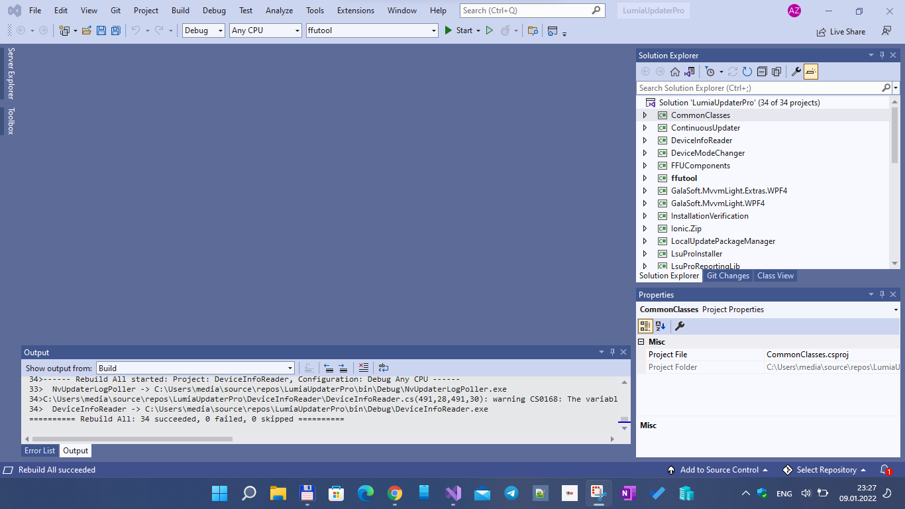
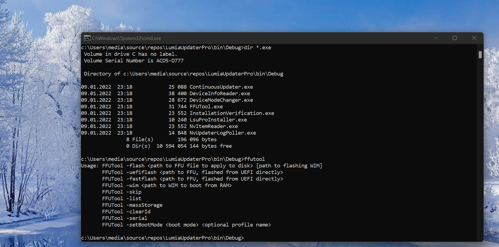

# Lumia Software Updater Pro

This is fork of Empyreal96's LumiaSoftwareUpdaterPro_Decompiled Project 

Status: not complete (RnD only)

## Some "shots"




## Few words about it...
    
1. All 34 projects "assembled" in one solution  
2. Project dependancies updated 
3. Minimal code refactoring (lite bugfixing) 
4. All binaries and dlls targeted to common /bin 


# About the original
Most components of "Lumia Software Updater Pro" decompiled with help of JetBrains dotpeek.


### Note:

- Some sources may be duplicates from sources in other repos, this is because they share some assemblies
- There may be some errors


### Component sources

```
CommonClasses
ContinuousUpdater
DeviceInfoReader
DeviceModeChanger
FFUComponents
ffutool
GalaSoft.MvvmLight.Extras.WPF4
GalaSoft.MvvmLight.WPF4
InstallationVerification
Ionic.Zip
LocalUpdatePackageManager
LsuProInstaller
LsuProReportingLib
LumiaConnectivity
Microsoft.IdentityModel.Clients.ActiveDirectory
Microsoft.IdentityModel.Clients.ActiveDirectory.WindowsForms
Nokia.Lucid
NvItemModule
NvItemReader
NvUpdaterLogPoller
OnlineUpdatePackageManager
PiaReader
SelfExtractingPackageCreator
SoftwareRepository
System.Data.SqlServerCe
System.Windows.Interactivity
UpdatePackageManager
Wp8AdvancedModeChanger
Wp8DeviceInformation
Wp8DeviceModeChanger
Wp8DeviceUpdater
Wp8EmergencyFlash
Wp8OemFlasher
Wp8RdcManager
```

### Contribute!
There's still a TON of things missing from this proof-of-concept (MVP) and areas of improvement 

With best wishes,

  [m][e] 2022

Lumia Software Updater Pro is RnD project only. AS-IS. No support. Distributed under the MIT License.


